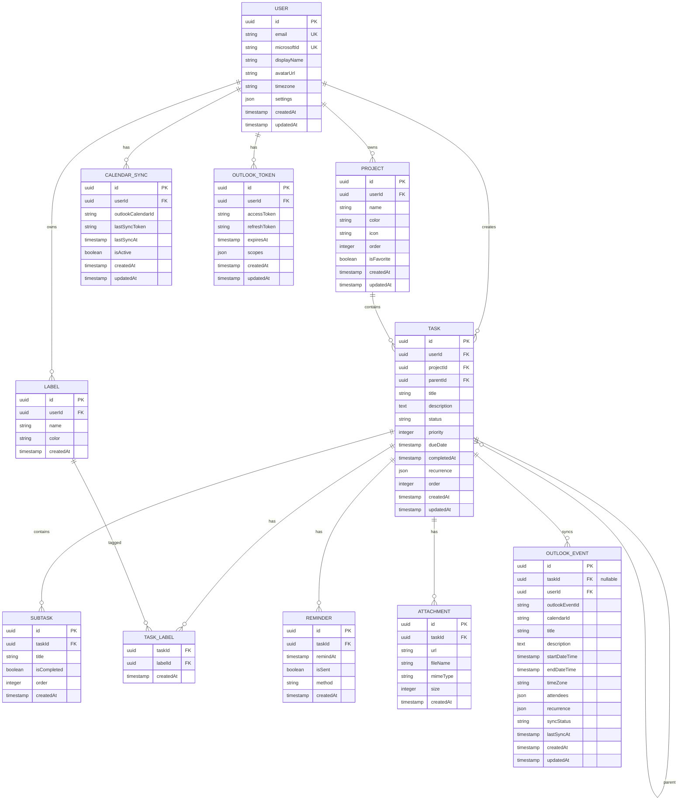

# Productivity Platform - Arquitectura y Documentación Técnica

## 📋 Índice

1. [Visión General del Producto](#visión-general-del-producto)
2. [Arquitectura del Sistema](#arquitectura-del-sistema)
3. [Decisiones Tecnológicas](#decisiones-tecnológicas)
4. [Modelo de Datos](#modelo-de-datos)
5. [Estructura del Proyecto](#estructura-del-proyecto)
6. [Roadmap de Desarrollo](#roadmap-de-desarrollo)
7. [Estrategia de Sincronización Outlook](#estrategia-de-sincronización-outlook)
8. [Seguridad y Escalabilidad](#seguridad-y-escalabilidad)

---

## Visión General del Producto

### Objetivo
Crear una plataforma SaaS de productividad personal que compita con Todoist y TickTick, ofreciendo:
- Gestión avanzada de tareas con jerarquía ilimitada
- Integración nativa con Microsoft Outlook Calendar
- Experiencia de usuario premium y minimalista
- Sincronización en tiempo real multi-dispositivo

### Público Objetivo
- Profesionales que usan Microsoft 365
- Equipos pequeños y medianos
- Usuarios power users de productividad
- Empresas que requieren integración con ecosistema Microsoft

### Diferenciadores Clave
1. **Integración profunda con Outlook** - Bidireccional y en tiempo real
2. **Arquitectura offline-first** - Funciona sin conexión
3. **Rendimiento extremo** - <100ms para cualquier acción
4. **Privacidad enterprise** - Encriptación end-to-end opcional

---

## Arquitectura del Sistema

### Diagrama de Arquitectura

```
┌─────────────────────────────────────────────────────────────────┐
│                         CLIENT LAYER                             │
├─────────────────────────────────────────────────────────────────┤
│  ┌─────────────┐  ┌─────────────┐  ┌─────────────┐              │
│  │   Web App   │  │  Mobile App │  │  Desktop    │              │
│  │  (Next.js)  │  │ (React Nat) │  │  (Electron) │              │
│  └──────┬──────┘  └──────┬──────┘  └──────┬──────┘              │
│         │                │                │                      │
│         └────────────────┴────────────────┘                      │
│                          │                                       │
│                    WebSocket                                      │
│                    REST API                                       │
└──────────────────────────┼───────────────────────────────────────┘
                           │
                           ▼
┌─────────────────────────────────────────────────────────────────┐
│                        API GATEWAY                               │
│                    (Nginx / Traefik)                             │
│  ┌─────────────────────────────────────────────────────────┐    │
│  │  Rate Limiting │ SSL Termination │ Load Balancing       │    │
│  └─────────────────────────────────────────────────────────┘    │
└──────────────────────────┬───────────────────────────────────────┘
                           │
                           ▼
┌─────────────────────────────────────────────────────────────────┐
│                     APPLICATION LAYER                            │
├─────────────────────────────────────────────────────────────────┤
│                   NestJS Microservices                           │
│  ┌──────────┐ ┌──────────┐ ┌──────────┐ ┌──────────┐           │
│  │   Auth   │ │  Tasks   │ │ Calendar │ │ Outlook  │           │
│  │ Service  │ │ Service  │ │ Service  │ │ Service  │           │
│  └────┬─────┘ └────┬─────┘ └────┬─────┘ └────┬─────┘           │
│       │            │            │            │                   │
│  ┌────┴────────────┴────────────┴────────────┴────┐             │
│  │            Message Broker (Redis)              │             │
│  │         Queues │ Pub/Sub │ Cache              │             │
│  └────────────────────────────────────────────────┘             │
└──────────────────────────┬───────────────────────────────────────┘
                           │
                           ▼
┌─────────────────────────────────────────────────────────────────┐
│                      DATA LAYER                                  │
├─────────────────────────────────────────────────────────────────┤
│  ┌─────────────┐  ┌─────────────┐  ┌─────────────┐              │
│  │ PostgreSQL  │  │    Redis    │  │  Timescale  │              │
│  │  (Primary)  │  │   (Cache)   │  │   (Analytics)│             │
│  └─────────────┘  └─────────────┘  └─────────────┘              │
└─────────────────────────────────────────────────────────────────┘
                           │
                           ▼
┌─────────────────────────────────────────────────────────────────┐
│                   EXTERNAL INTEGRATIONS                          │
├─────────────────────────────────────────────────────────────────┤
│  ┌─────────────┐  ┌─────────────┐  ┌─────────────┐              │
│  │  Microsoft  │  │   Push      │  │   Email     │              │
│  │   Graph API │  │  Services   │  │   (SMTP)    │              │
│  └─────────────┘  └─────────────┘  └─────────────┘              │
└─────────────────────────────────────────────────────────────────┘
```

### Componentes Principales

#### 1. Frontend (Next.js)
- **SSR/SSG**: Renderizado híbrido para SEO y performance
- **Service Workers**: Cache offline y background sync
- **WebSocket**: Actualizaciones en tiempo real
- **Local First**: IndexedDB para datos locales

#### 2. Backend (NestJS)
- **Modular**: Cada dominio es un módulo independiente
- **Event-Driven**: Arquitectura basada en eventos
- **CQRS**: Separación de comandos y queries
- **DDD**: Domain-Driven Design

#### 3. Base de Datos
- **PostgreSQL**: Datos relacionales principales
- **Redis**: Cache, sesiones, colas
- **Prisma**: ORM type-safe

#### 4. Infraestructura
- **Docker**: Contenerización completa
- **Kubernetes**: Orquestación (producción)
- **CI/CD**: GitHub Actions

---

## Decisiones Tecnológicas

### Frontend Stack

| Tecnología | Versión | Justificación |
|------------|---------|---------------|
| React | 18+ | Concurrent features, Suspense |
| Next.js | 14+ | App Router, Server Components |
| TypeScript | 5+ | Type safety, mejor DX |
| TailwindCSS | 3+ | Utility-first, rápido desarrollo |
| Zustand | 4+ | State management ligero |
| TanStack Query | 5+ | Server state, caching |
| React Hook Form | 7+ | Performance en formularios |
| Zod | 3+ | Validación schema-based |
| date-fns | 3+ | Manejo de fechas ligero |
| dnd-kit | 6+ | Drag & drop moderno |

### Backend Stack

| Tecnología | Versión | Justificación |
|------------|---------|---------------|
| Node.js | 20 LTS | Performance, ecosystem |
| NestJS | 10+ | Arquitectura enterprise |
| TypeScript | 5+ | Type safety completo |
| Prisma | 5+ | Type-safe ORM, migrations |
| Passport.js | 0.6+ | Estrategias auth múltiples |
| BullMQ | 5+ | Colas con Redis |
| Winston | 3+ | Logging estructurado |
| Jest | 29+ | Testing framework |
| Swagger | 7+ | Documentación API |

### Infraestructura

| Tecnología | Uso |
|------------|-----|
| Docker | Contenedores desarrollo/producción |
| Docker Compose | Entorno local |
| Nginx | Reverse proxy, SSL |
| Redis | Cache, sesiones, colas |
| PostgreSQL 15 | Base de datos principal |
| pgBouncer | Connection pooling |

### Microsoft Integration

| API | Uso |
|-----|-----|
| Microsoft Graph | Outlook Calendar, Users |
| MSAL | Autenticación OAuth 2.0 |
| Webhooks | Notificaciones cambios Outlook |
| Delta Query | Sync eficiente de eventos |

---

## Modelo de Datos

### Diagrama Entidad-Relación



### Schema Prisma Completo

```prisma
// schema.prisma

generator client {
  provider = "prisma-client-js"
}

datasource db {
  provider = "postgresql"
  url      = env("DATABASE_URL")
}

// ============================================
// ENUMS
// ============================================

enum TaskStatus {
  PENDING
  IN_PROGRESS
  COMPLETED
  CANCELLED
}

enum TaskPriority {
  NONE
  LOW
  MEDIUM
  HIGH
  URGENT
}

enum RecurrenceFrequency {
  DAILY
  WEEKLY
  MONTHLY
  YEARLY
  CUSTOM
}

enum ReminderMethod {
  PUSH
  EMAIL
  BOTH
}

enum SyncStatus {
  PENDING
  SYNCED
  CONFLICT
  FAILED
}

enum UserRole {
  USER
  PREMIUM
  ADMIN
}

// ============================================
// MODELOS PRINCIPALES
// ============================================

model User {
  id             String          @id @default(uuid())
  email          String          @unique
  microsoftId    String?         @unique
  displayName    String?
  avatarUrl      String?
  timezone       String          @default("UTC")
  role           UserRole        @default(USER)
  settings       Json            @default("{\"theme\":\"light\",\"language\":\"es\",\"notifications\":true}")
  
  projects       Project[]
  tasks          Task[]
  labels         Label[]
  reminders      Reminder[]
  attachments    Attachment[]
  outlookTokens  OutlookToken[]
  calendarSyncs  CalendarSync[]
  outlookEvents  OutlookEvent[]
  
  createdAt      DateTime        @default(now())
  updatedAt      DateTime        @updatedAt
  
  @@index([email])
  @@index([microsoftId])
}

model Project {
  id          String    @id @default(uuid())
  userId      String
  name        String
  color       String    @default("#3B82F6")
  icon        String?
  order       Int       @default(0)
  isFavorite  Boolean   @default(false)
  isArchived  Boolean   @default(false)
  
  user        User      @relation(fields: [userId], references: [id], onDelete: Cascade)
  tasks       Task[]
  
  createdAt   DateTime  @default(now())
  updatedAt   DateTime  @updatedAt
  
  @@unique([userId, name])
  @@index([userId])
  @@index([userId, isFavorite])
}

model Task {
  id          String      @id @default(uuid())
  userId      String
  projectId   String?
  parentId    String?
  title       String
  description String?     @db.Text
  status      TaskStatus  @default(PENDING)
  priority    TaskPriority @default(NONE)
  dueDate     DateTime?
  completedAt DateTime?
  
  // Recurrencia
  recurrence  Json? // { frequency: RecurrenceFrequency, interval: Int, daysOfWeek: Int[], endDate: DateTime }
  
  // Ordenamiento
  order       Int       @default(0)
  
  // Relaciones
  user        User      @relation(fields: [userId], references: [id], onDelete: Cascade)
  project     Project?  @relation(fields: [projectId], references: [id], onDelete: SetNull)
  parent      Task?     @relation("TaskHierarchy", fields: [parentId], references: [id], onDelete: Cascade)
  children    Task[]    @relation("TaskHierarchy")
  
  subtasks    Subtask[]
  labels      TaskLabel[]
  reminders   Reminder[]
  attachments Attachment[]
  outlookEvent OutlookEvent?
  
  createdAt   DateTime  @default(now())
  updatedAt   DateTime  @updatedAt
  
  @@index([userId])
  @@index([userId, status])
  @@index([userId, dueDate])
  @@index([userId, projectId])
  @@index([userId, priority])
  @@index([projectId])
  @@index([status, dueDate])
}

model Subtask {
  id          String   @id @default(uuid())
  taskId      String
  title       String
  isCompleted Boolean  @default(false)
  order       Int      @default(0)
  
  task        Task     @relation(fields: [taskId], references: [id], onDelete: Cascade)
  
  createdAt   DateTime @default(now())
  
  @@index([taskId])
}

model Label {
  id        String      @id @default(uuid())
  userId    String
  name      String
  color     String      @default("#6B7280")
  
  user      User        @relation(fields: [userId], references: [id], onDelete: Cascade)
  tasks     TaskLabel[]
  
  createdAt DateTime    @default(now())
  
  @@unique([userId, name])
  @@index([userId])
}

model TaskLabel {
  taskId    String
  labelId   String
  createdAt DateTime @default(now())
  
  task      Task   @relation(fields: [taskId], references: [id], onDelete: Cascade)
  label     Label  @relation(fields: [labelId], references: [id], onDelete: Cascade)
  
  @@id([taskId, labelId])
  @@index([labelId])
}

model Reminder {
  id        String         @id @default(uuid())
  taskId    String
  remindAt  DateTime
  isSent    Boolean        @default(false)
  method    ReminderMethod @default(PUSH)
  
  task      Task           @relation(fields: [taskId], references: [id], onDelete: Cascade)
  
  createdAt DateTime       @default(now())
  
  @@index([taskId])
  @@index([remindAt, isSent])
}

model Attachment {
  id        String   @id @default(uuid())
  taskId    String
  url       String
  fileName  String
  mimeType  String
  size      Int
  
  task      Task     @relation(fields: [taskId], references: [id], onDelete: Cascade)
  
  createdAt DateTime @default(now())
  
  @@index([taskId])
}

// ============================================
// MODELOS DE INTEGRACIÓN OUTLOOK
// ============================================

model OutlookToken {
  id           String   @id @default(uuid())
  userId       String
  accessToken  String   @db.Text
  refreshToken String   @db.Text
  expiresAt    DateTime
  scopes       String[]
  
  user         User     @relation(fields: [userId], references: [id], onDelete: Cascade)
  
  createdAt    DateTime @default(now())
  updatedAt    DateTime @updatedAt
  
  @@unique([userId])
  @@index([expiresAt])
}

model CalendarSync {
  id              String    @id @default(uuid())
  userId          String
  outlookCalendarId String
  name            String
  color           String?
  lastSyncToken   String?
  lastSyncAt      DateTime?
  isActive        Boolean   @default(true)
  syncInterval    Int       @default(300) // segundos
  
  user            User      @relation(fields: [userId], references: [id], onDelete: Cascade)
  
  createdAt       DateTime  @default(now())
  updatedAt       DateTime  @updatedAt
  
  @@unique([userId, outlookCalendarId])
  @@index([userId, isActive])
}

model OutlookEvent {
  id              String     @id @default(uuid())
  taskId          String?    // Null si es solo evento Outlook
  userId          String
  outlookEventId  String
  calendarId      String
  title           String
  description     String?    @db.Text
  startDateTime   DateTime
  endDateTime     DateTime
  timeZone        String     @default("UTC")
  isAllDay        Boolean    @default(false)
  location        String?
  attendees       Json?      // [{ email, name, status }]
  recurrence      Json?      // Patrón de recurrencia de Outlook
  syncStatus      SyncStatus @default(PENDING)
  lastSyncAt      DateTime?
  conflictData    Json?      // Datos para resolver conflictos
  
  task            Task?      @relation(fields: [taskId], references: [id], onDelete: SetNull)
  user            User       @relation(fields: [userId], references: [id], onDelete: Cascade)
  
  createdAt       DateTime   @default(now())
  updatedAt       DateTime   @updatedAt
  
  @@unique([userId, outlookEventId])
  @@index([userId, startDateTime])
  @@index([userId, calendarId])
  @@index([taskId])
  @@index([syncStatus])
}

// ============================================
// MODELOS DE ANALÍTICAS
// ============================================

model ProductivityLog {
  id            String   @id @default(uuid())
  userId        String
  date          DateTime @db.Date
  tasksCreated  Int      @default(0)
  tasksCompleted Int     @default(0)
  focusTime     Int      @default(0) // minutos
  
  user          User     @relation(fields: [userId], references: [id], onDelete: Cascade)
  
  createdAt     DateTime @default(now())
  
  @@unique([userId, date])
  @@index([userId, date])
}
```

---

## Estructura del Proyecto

### Monorepo Structure

```
productivity-platform/
├── .github/
│   ├── workflows/
│   │   ├── ci.yml
│   │   ├── cd-staging.yml
│   │   └── cd-production.yml
│   └── ISSUE_TEMPLATE/
│       ├── bug_report.md
│       └── feature_request.md
│
├── apps/
│   ├── web/                          # Next.js Frontend
│   │   ├── public/
│   │   │   ├── icons/
│   │   │   └── locales/
│   │   ├── src/
│   │   │   ├── app/                  # Next.js App Router
│   │   │   │   ├── (auth)/
│   │   │   │   │   ├── login/
│   │   │   │   │   └── callback/
│   │   │   │   ├── (dashboard)/
│   │   │   │   │   ├── layout.tsx
│   │   │   │   │   ├── page.tsx      # Inbox view
│   │   │   │   │   ├── today/
│   │   │   │   │   ├── upcoming/
│   │   │   │   │   ├── projects/
│   │   │   │   │   │   ├── [id]/
│   │   │   │   │   │   └── page.tsx
│   │   │   │   │   ├── labels/
│   │   │   │   │   │   └── [id]/
│   │   │   │   │   ├── calendar/
│   │   │   │   │   └── settings/
│   │   │   │   ├── api/              # API Routes (BFF)
│   │   │   │   └── layout.tsx
│   │   │   ├── components/
│   │   │   │   ├── ui/               # Base components
│   │   │   │   │   ├── Button.tsx
│   │   │   │   │   ├── Input.tsx
│   │   │   │   │   ├── Modal.tsx
│   │   │   │   │   └── ...
│   │   │   │   ├── layout/
│   │   │   │   │   ├── Sidebar.tsx
│   │   │   │   │   ├── Header.tsx
│   │   │   │   │   └── MainLayout.tsx
│   │   │   │   ├── tasks/
│   │   │   │   │   ├── TaskList.tsx
│   │   │   │   │   ├── TaskItem.tsx
│   │   │   │   │   ├── TaskForm.tsx
│   │   │   │   │   ├── SubtaskList.tsx
│   │   │   │   │   └── TaskFilters.tsx
│   │   │   │   ├── projects/
│   │   │   │   ├── calendar/
│   │   │   │   ├── outlook/
│   │   │   │   └── dashboard/
│   │   │   ├── hooks/
│   │   │   │   ├── useTasks.ts
│   │   │   │   ├── useProjects.ts
│   │   │   │   ├── useOutlookSync.ts
│   │   │   │   └── useKeyboardShortcuts.ts
│   │   │   ├── services/
│   │   │   │   ├── api.ts
│   │   │   │   ├── tasks.service.ts
│   │   │   │   ├── outlook.service.ts
│   │   │   │   └── websocket.service.ts
│   │   │   ├── store/
│   │   │   │   ├── index.ts
│   │   │   │   ├── tasks.store.ts
│   │   │   │   ├── projects.store.ts
│   │   │   │   └── ui.store.ts
│   │   │   ├── types/
│   │   │   │   ├── task.types.ts
│   │   │   │   ├── project.types.ts
│   │   │   │   └── outlook.types.ts
│   │   │   ├── utils/
│   │   │   │   ├── date.utils.ts
│   │   │   │   ├── sync.utils.ts
│   │   │   │   └── validation.utils.ts
│   │   │   └── middleware.ts
│   │   ├── next.config.js
│   │   ├── tailwind.config.js
│   │   ├── tsconfig.json
│   │   └── package.json
│   │
│   └── api/                          # NestJS Backend
│       ├── src/
│       │   ├── main.ts
│       │   ├── app.module.ts
│       │   ├── common/
│       │   │   ├── decorators/
│       │   │   │   ├── user.decorator.ts
│       │   │   │   └── roles.decorator.ts
│       │   │   ├── filters/
│       │   │   │   └── http-exception.filter.ts
│       │   │   ├── guards/
│       │   │   │   ├── jwt.guard.ts
│       │   │   │   └── roles.guard.ts
│       │   │   ├── interceptors/
│       │   │   │   ├── logging.interceptor.ts
│       │   │   │   └── transform.interceptor.ts
│       │   │   └── utils/
│       │   │       └── pagination.util.ts
│       │   ├── auth/
│       │   │   ├── auth.module.ts
│       │   │   ├── auth.controller.ts
│       │   │   ├── auth.service.ts
│       │   │   ├── strategies/
│       │   │   │   ├── jwt.strategy.ts
│       │   │   │   └── microsoft.strategy.ts
│       │   │   └── dto/
│       │   │       └── login.dto.ts
│       │   ├── tasks/
│       │   │   ├── tasks.module.ts
│       │   │   ├── tasks.controller.ts
│       │   │   ├── tasks.service.ts
│       │   │   ├── entities/
│       │   │   │   ├── task.entity.ts
│       │   │   │   └── subtask.entity.ts
│       │   │   ├── dto/
│       │   │   │   ├── create-task.dto.ts
│       │   │   │   ├── update-task.dto.ts
│       │   │   │   └── task-filters.dto.ts
│       │   │   └── events/
│       │   │       └── task-created.event.ts
│       │   ├── projects/
│       │   ├── labels/
│       │   ├── calendar/
│       │   ├── outlook/
│       │   │   ├── outlook.module.ts
│       │   │   ├── outlook.controller.ts
│       │   │   ├── outlook.service.ts
│       │   │   ├── outlook-webhook.service.ts
│       │   │   ├── outlook-sync.service.ts
│       │   │   └── dto/
│       │   │       └── sync-calendar.dto.ts
│       │   ├── dashboard/
│       │   ├── notifications/
│       │   └── database/
│       │       └── prisma.service.ts
│       ├── test/
│       ├── nest-cli.json
│       ├── tsconfig.json
│       └── package.json
│
├── packages/
│   ├── database/                     # Prisma Database Package
│   │   ├── prisma/
│   │   │   ├── schema.prisma
│   │   │   ├── migrations/
│   │   │   └── seed.ts
│   │   ├── src/
│   │   │   └── index.ts
│   │   └── package.json
│   │
│   ├── shared-types/                 # Tipos compartidos
│   │   ├── src/
│   │   │   ├── task.types.ts
│   │   │   ├── user.types.ts
│   │   │   └── api.types.ts
│   │   └── package.json
│   │
│   └── eslint-config/                # Config ESLint compartida
│       └── package.json
│
├── docker/
│   ├── docker-compose.yml
│   ├── docker-compose.prod.yml
│   ├── nginx/
│   │   └── nginx.conf
│   └── scripts/
│       ├── init-db.sh
│       └── backup.sh
│
├── docs/
│   ├── ARCHITECTURE.md
│   ├── API.md
│   ├── DEPLOYMENT.md
│   └── CONTRIBUTING.md
│
├── .env.example
├── .gitignore
├── package.json                      # Root package.json (Turbo)
├── turbo.json
├── README.md
└── tsconfig.base.json
```

---

## Roadmap de Desarrollo

### Fase 1: Fundación (Semanas 1-3)
**Objetivo**: Setup del proyecto y autenticación básica

#### Semana 1: Infrastructure & Setup
- [x] Configuración del monorepo con Turborepo
- [x] Setup de Docker y Docker Compose
- [x] Configuración de PostgreSQL y Prisma
- [x] Setup de NestJS con módulos base
- [x] Setup de Next.js con App Router
- [x] Configuración de TailwindCSS y design tokens
- [x] CI/CD pipeline básico

#### Semana 2: Autenticación Microsoft
- [ ] Registro de app en Azure AD
- [ ] Implementación de OAuth 2.0 flow
- [ ] Estrategia Passport Microsoft
- [ ] JWT token management
- [ ] Refresh token rotation
- [ ] Session management con Redis
- [ ] Protected routes frontend

#### Semana 3: Modelo de Datos Core
- [ ] Migraciones Prisma iniciales
- [ ] Seed data para desarrollo
- [ ] Repositorios base
- [ ] Servicios CRUD usuarios
- [ ] Tests unitarios auth

**Entregables Fase 1**:
- ✅ Login funcional con Microsoft
- ✅ Sesiones persistentes
- ✅ Database schema inicial
- ✅ Ambiente de desarrollo funcionando

---

### Fase 2: Gestión de Tareas (Semanas 4-7)
**Objetivo**: CRUD completo de tareas con todas las características

#### Semana 4: Tareas Básicas
- [ ] Create/Read/Update/Delete tareas
- [ ] Validaciones con Zod/class-validator
- [ ] Filtros básicos (estado, fecha)
- [ ] Búsqueda full-text
- [ ] Paginación y cursor-based loading

#### Semana 5: Características Avanzadas
- [ ] Prioridades (4 niveles)
- [ ] Fechas de vencimiento
- [ ] Timezones handling
- [ ] Ordenamiento personalizado
- [ ] Bulk operations

#### Semana 6: Subtareas y Jerarquía
- [ ] Subtareas ilimitadas
- [ ] Checklist progress
- [ ] Convertir tarea a subtarea
- [ ] Vista jerárquica

#### Semana 7: Etiquetas y Organización
- [ ] Sistema de etiquetas
- [ ] Múltiples etiquetas por tarea
- [ ] Filtrado por etiquetas
- [ ] Colores personalizados

**Entregables Fase 2**:
- ✅ Gestión completa de tareas
- ✅ Subtareas y jerarquía
- ✅ Etiquetas y organización
- ✅ Búsqueda avanzada

---

### Fase 3: Proyectos y Dashboard (Semanas 8-10)
**Objetivo**: Organización por proyectos y métricas

#### Semana 8: Proyectos
- [ ] CRUD proyectos
- [ ] Colores e iconos
- [ ] Favoritos
- [ ] Archivar proyectos
- [ ] Mover tareas entre proyectos

#### Semana 9: Vistas Inteligentes
- [ ] Vista "Inbox" (sin proyecto)
- [ ] Vista "Hoy"
- [ ] Vista "Próximos 7 días"
- [ ] Vista "En algún momento"
- [ ] Smart filters guardados

#### Semana 10: Dashboard de Productividad
- [ ] Tareas completadas por día/semana/mes
- [ ] Gráficos de productividad
- [ ] Racha de días productivos
- [ ] Tiempo de enfoque
- [ ] Export de datos

**Entregables Fase 3**:
- ✅ Proyectos y organización
- ✅ Vistas inteligentes
- ✅ Dashboard de productividad

---

### Fase 4: Recordatorios y Recurrencia (Semanas 11-13)
**Objetivo**: Automatización y seguimiento

#### Semana 11: Recordatorios
- [ ] Recordatorios por fecha/hora
- [ ] Múltiples recordatorios por tarea
- [ ] Notificaciones push (Web Push API)
- [ ] Notificaciones email
- [ ] Snooze functionality

#### Semana 12: Tareas Recurrentes
- [ ] Recurrencia diaria/semanal/mensual/anual
- [ ] Días específicos de la semana
- [ ] "Cada N días/semanas/meses"
- [ ] Fecha fin de recurrencia
- [ ] Instancias de tareas recurrentes

#### Semana 13: Sistema de Notificaciones
- [ ] Cola de notificaciones con BullMQ
- [ ] Worker de procesamiento
- [ ] Preferencias de notificación
- [ ] Centro de notificaciones
- [ ] Mark as read

**Entregables Fase 4**:
- ✅ Recordatorios programados
- ✅ Tareas recurrentes avanzadas
- ✅ Sistema de notificaciones

---

### Fase 5: Integración Outlook Calendar (Semanas 14-18)
**Objetivo**: Sincronización bidireccional completa

#### Semana 14: OAuth y Tokens
- [ ] Permisos adicionales Graph API
- [ ] Almacenamiento seguro de tokens
- [ ] Auto-refresh de tokens
- [ ] Manejo de token expiration
- [ ] Revocación de acceso

#### Semana 15: Lectura de Eventos
- [ ] Fetch de calendarios Outlook
- [ ] Fetch de eventos por calendario
- [ ] Delta query para sync eficiente
- [ ] Manejo de timezones
- [ ] Paginación de eventos

#### Semana 16: Creación y Edición
- [ ] Crear evento Outlook desde tarea
- [ ] Editar evento Outlook
- [ ] Eliminar evento Outlook
- [ ] Mapeo de campos task ↔ event
- [ ] Manejo de asistentes

#### Semana 17: Sincronización Bidireccional
- [ ] Webhooks Microsoft Graph
- [ ] Endpoint para notificaciones
- [ ] Validación de webhooks
- [ ] Procesamiento de cambios
- [ ] Resolución de conflictos

#### Semana 18: Calendario Integrado
- [ ] Vista de calendario frontend
- [ ] Drag & drop de eventos
- [ ] Vista día/semana/mes
- [ ] Toggle de calendarios
- [ ] Indicadores de sync

**Entregables Fase 5**:
- ✅ OAuth completo Microsoft
- ✅ Lectura eventos Outlook
- ✅ Creación/edición eventos
- ✅ Sincronización bidireccional
- ✅ Webhooks en tiempo real
- ✅ Vista calendario integrada

---

### Fase 6: UX/UI y Optimización (Semanas 19-21)
**Objetivo**: Experiencia de usuario premium

#### Semana 19: UI Refinements
- [ ] Animaciones y transiciones
- [ ] Loading states y skeletons
- [ ] Empty states
- [ ] Error boundaries
- [ ] Toast notifications

#### Semana 20: Performance
- [ ] Code splitting
- [ ] Lazy loading componentes
- [ ] Image optimization
- [ ] Bundle analysis
- [ ] Lighthouse score >90

#### Semana 21: Offline & PWA
- [ ] Service worker
- [ ] IndexedDB caching
- [ ] Background sync
- [ ] Install prompt
- [ ] Offline fallback

**Entregables Fase 6**:
- ✅ UI/UX pulida
- ✅ Performance optimizada
- ✅ PWA funcional
- ✅ Soporte offline básico

---

### Fase 7: Testing y Producción (Semanas 22-24)
**Objetivo**: Preparación para lanzamiento

#### Semana 22: Testing
- [ ] Tests unitarios backend (>80% coverage)
- [ ] Tests unitarios frontend
- [ ] Tests de integración
- [ ] E2E tests con Playwright
- [ ] Load testing

#### Semana 23: Seguridad y Compliance
- [ ] Security audit
- [ ] Penetration testing
- [ ] GDPR compliance
- [ ] Data encryption at rest
- [ ] Rate limiting
- [ ] CORS configuration

#### Semana 24: Deployment
- [ ] Kubernetes manifests
- [ ] Helm charts
- [ ] Monitoring (Prometheus/Grafana)
- [ ] Logging centralizado
- [ ] Alerting
- [ ] Backup strategy
- [ ] Disaster recovery plan

**Entregables Fase 7**:
- ✅ Suite de tests completa
- ✅ Security hardening
- ✅ Infraestructura production-ready
- ✅ Monitoring y alerting

---

## Estrategia de Sincronización Outlook

### Arquitectura de Sync

```
┌─────────────────┐     ┌──────────────────┐     ┌─────────────────┐
│   Outlook API   │────▶│   Webhook        │────▶│   Sync Service  │
│   (Graph API)   │     │   Endpoint       │     │                 │
└─────────────────┘     └──────────────────┘     └────────┬────────┘
                                                          │
         ┌────────────────────────────────────────────────┘
         │
         ▼
┌─────────────────┐     ┌──────────────────┐     ┌─────────────────┐
│   Delta Query   │────▶│   Conflict       │────▶│   Database      │
│   (Polling)     │     │   Resolution     │     │   (PostgreSQL)  │
└─────────────────┘     └──────────────────┘     └─────────────────┘
```

### Flow de Sincronización

#### 1. Initial Sync
```typescript
// 1. Obtener lista de calendarios
GET /me/calendars

// 2. Para cada calendario, obtener eventos con delta link
GET /me/calendars/{id}/events?$deltatoken=latest

// 3. Guardar delta token para futuros syncs
// 4. Transformar eventos a formato interno
// 5. Guardar en base de datos
```

#### 2. Incremental Sync (Delta Query)
```typescript
// Usar el delta token guardado
GET /me/calendars/{id}/events?$deltatoken={savedToken}

// Respuesta incluye:
// - Eventos creados/actualizados
// - Eventos eliminados (@removed)
// - Nuevo delta token
```

#### 3. Webhook Notifications
```typescript
// 1. Suscribirse a cambios
POST /subscriptions
{
  "changeType": "created,updated,deleted",
  "resource": "me/events",
  "notificationUrl": "https://api.app.com/outlook/webhook",
  "expirationDateTime": "2024-01-01T00:00:00Z"
}

// 2. Recibir notificación
POST /outlook/webhook
{
  "value": [{
    "subscriptionId": "...",
    "clientState": "...",
    "changeType": "updated",
    "resource": "me/events(id)"
  }]
}

// 3. Validar notificación
// 4. Hacer delta query para obtener cambios
// 5. Aplicar cambios a base de datos
```

### Resolución de Conflictos

#### Estrategia: Last Write Wins con Tracking

```typescript
interface ConflictResolution {
  // Reglas de prioridad
  priority: 'LOCAL_WINS' | 'REMOTE_WINS' | 'MANUAL';
  
  // Campos que siempre ganan del remoto
  remoteAlwaysWins: ['attendees', 'responseStatus'];
  
  // Campos que siempre ganan del local
  localAlwaysWins: ['title', 'description', 'priority'];
  
  // Timestamp tracking
  lastModifiedBy: 'LOCAL' | 'REMOTE';
  localModifiedAt: Date;
  remoteModifiedAt: Date;
}

// Algoritmo de resolución
async function resolveConflict(
  localTask: Task,
  remoteEvent: OutlookEvent
): Promise<ResolvedEntity> {
  // 1. Comparar timestamps
  if (remoteEvent.lastModifiedAt > localTask.updatedAt) {
    // 2. Aplicar reglas campo por campo
    return mergeWithRules(localTask, remoteEvent);
  }
  
  // 3. Si local es más reciente, mantener local
  // 4. Opcionalmente, actualizar remoto con cambios locales
  return localTask;
}
```

### Manejo de Timezones

```typescript
// Siempre guardar en UTC en la base de datos
// Almacenar timezone original como metadato
interface DateTimeWithZone {
  dateTime: string; // ISO 8601 en UTC
  timeZone: string; // IANA timezone (ej: "America/Mexico_City")
}

// Conversión para display
function toUserTimezone(utcDate: Date, userTimezone: string): Date {
  return tz(utcDate, userTimezone);
}

// Conversión para Outlook
function toOutlookFormat(date: Date, timezone: string): OutlookDateTime {
  return {
    dateTime: format(date, "yyyy-MM-dd'T'HH:mm:ss"),
    timeZone: timezone
  };
}
```

---

## Seguridad y Escalabilidad

### Seguridad

#### Autenticación y Autorización
```typescript
// JWT Strategy
{
  algorithm: 'RS256',
  expiresIn: '15m',
  refreshExpiresIn: '7d'
}

// Refresh Token Rotation
- Cada refresh genera nuevo par de tokens
- Old refresh tokens son invalidados
- Reuse detection para prevenir ataques
```

#### Protección de APIs
```yaml
Rate Limiting:
  authenticated: 1000 requests/hour
  anonymous: 100 requests/hour
  sensitive_endpoints: 10 requests/minute

CORS:
  allowed_origins: [production_domain]
  credentials: true
  methods: [GET, POST, PUT, DELETE]

Headers:
  - Strict-Transport-Security
  - X-Content-Type-Options
  - X-Frame-Options: DENY
  - Content-Security-Policy
```

#### Encriptación
```typescript
// Data at rest
- PostgreSQL TDE (Transparent Data Encryption)
- Tokens encriptados con AES-256

// Data in transit
- TLS 1.3 obligatorio
- HSTS preload

// Sensitive fields
- Access tokens: Encriptado en DB
- PII: Encriptado opcional
```

### Escalabilidad

#### Horizontal Scaling
```yaml
API Instances:
  min: 2
  max: 10
  scaling_metric: CPU > 70%

Database:
  - Read replicas para queries
  - Connection pooling (pgBouncer)
  - Partitioning por usuario (futuro)

Cache:
  - Redis cluster
  - Cache-aside pattern
  - TTL estratégico
```

#### Performance Targets
```
P95 Latency:
  - API responses: < 200ms
  - Database queries: < 50ms
  - Cache hits: < 10ms

Throughput:
  - Requests/second: 1000+
  - Concurrent users: 10,000+

Availability:
  - Uptime: 99.9%
  - RTO: < 1 hour
  - RPO: < 5 minutes
```

#### Database Optimization
```sql
-- Indexes estratégicos
CREATE INDEX idx_tasks_user_status ON tasks(user_id, status);
CREATE INDEX idx_tasks_due_date ON tasks(user_id, due_date);
CREATE INDEX idx_events_user_start ON outlook_events(user_id, start_date_time);

-- Query optimization
- Use EXPLAIN ANALYZE
- Avoid N+1 queries
- Batch operations
- Materialized views para analytics
```

---

## Próximos Pasos

Esta documentación representa la **FASE 1** completa del proyecto. Una vez revisada y aprobada, procederemos con:

1. **Setup del entorno de desarrollo**
2. **Implementación de autenticación Microsoft**
3. **CRUD básico de tareas**

¿Hay algún aspecto de la arquitectura que te gustaría ajustar o alguna decisión tecnológica que quieras discutir antes de comenzar la implementación?
